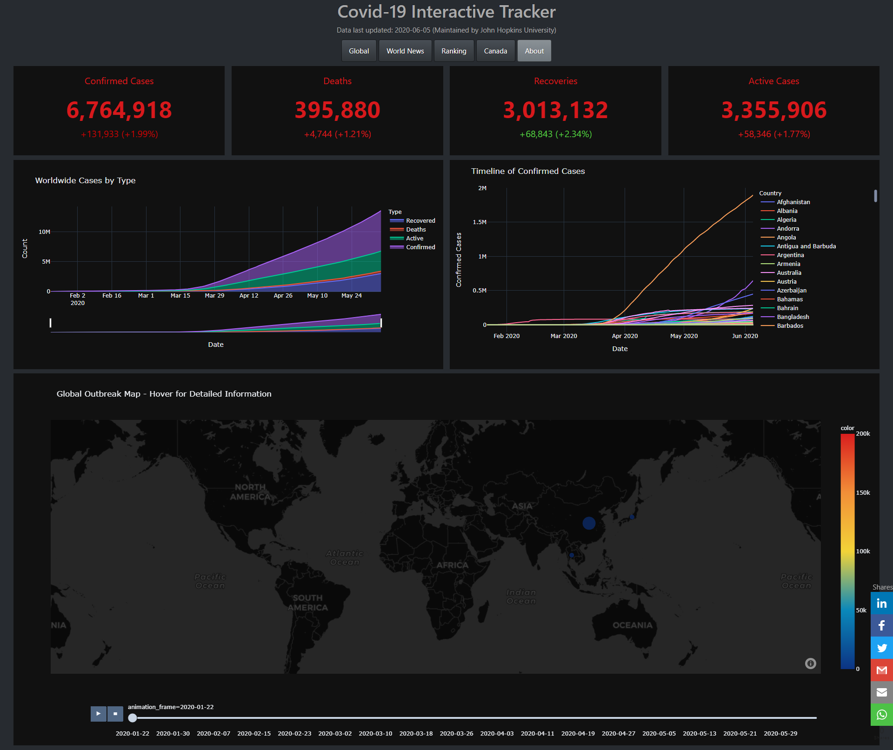

# COVID-19-Dashboard Web App


This interactive dashboard is aimed at providing users with a daily summary of the global situation on Covid-19. It is intended for those seeking a concise breakdown of the numbers, without the constant news updates. There is also a snapshot for Canadian cases, and can be expanded to other regions in the future as necessary.




## Getting Started

These instructions will get you a copy of the project up and running on your local machine for development and testing purposes. See deployment for notes on how to deploy the project on a live system.

### Prerequisites

Libraries and software used to create the environment and deploy the app

```
* Python 3.7
* Packages: numpy, pandas, plotly, dash
* Basic HTML/CSS for configuring and styling the web app
* Knowledge on setting up a virtual environment
```

### Tools
```
* An IDE such as VS Code, PyCharm
* Python libraries listed in the requirements.txt file
* A Heroku account for deployment
```

### Data sources

1) John Hopkins University - Dataset for Covid-19 cases
2) Georgia State University - Common twitter mentions for Covid-19
3) Twitter - Covid-19 related tweets scraped using the 'twitterscraper' package


## Project Walkthrough

### Data Cleaning
After pulling the JHU data, I needed to clean it up so that it was usable for the web app. This is shown in the ETL.py file. I made the following changes and created the following variables:

*	Converted 'Date' object to datetime
* Fill null values with 0 (countries with 0 conf/rec/deaths)
* Create a computed column 'Active' cases
* Remove province/state, group each country by date
* Update latitude and longitude for countries who are spread due to multiple colonies/provinces
* Create a description column including ass summary statistics for the choropleth map hoverdata
* Create a Canada specific data frame with day-over-day deltas using the .diff() method

### Web Scraping
Used the Twitter web scraper package to pull Tweets containing Covid related words.

*	Pull top 100 tweets based on the current data set update date
* Filter for English only tweets
* Concatenate and convert twitter query into a pandas dataframe for processing
* Rename columns, remove duplicate rows, drop null tweets

### Twitter Sentiment Analysis

* Using the vaderSentiment package, use the Sentiment Intensity Analyzer to divide tweets in to negative, neutral and positive sentiment categories


### Twitter top 100 Common Covid Phrases

* Courtesy of Georgia State University, supply the most common Covid-related twitter phrases
* These prases are found in the body of all covid related tweets


## Putting the Pieces Together

The dashboard contains buttons to select different areas of interest. The following views are available:
```
* Global - cases at the national scale
* World News - top news stories and covid-related Tweets
* Ranking - top 20 countries ordered by confirmed cases
* Canada - timeline of cases broken down by province
* About - additional info about the app and contact information
```


### Number Plates

The app includes header of number plates for all views. This is the global count of cases, which includes a ticker beneath for the delta from the previous day. The % change is also included.

This data is refreshed nightly by John Hopkins University.


### World News

A small rss-feed is displayed on the left pane. The intention is a non-intrusive feed, with onbjective information on Covid-19 updates.


### Canada

Being Canadian, I wanted to explore the outbreak and how it differs acorss each province in the country. The day-over-day view helps depict how the virus has spread over time.


## App Deployment

Upon significant testing in the local virtual environment, the app was deployed online through Heroku. This is the free version, whereby the app goes to sleep after 30 minutes of inactivity - so loading times may vary depending upon when the app is opened.

## Final Thoughts

This app provides a good starting point for displaying some relevant statistics as the virus spreads across the globe. During this time, continual improvements can be made, such as dedicated tabs for each continent, as well as some more variance in the plots shown. Styling of the app can also be improved for ease-of-use.
